# SynthData Architect 🏗️🤖

**SynthData Architect** is an autonomous AI system designed to generate high-quality, massive synthetic datasets based on natural language rules.

Powered by **LangGraph** and **OpenAI**, it orchestrates a team of AI Agents that **write, execute, and validate** optimized Python code (using Pandas/NumPy) to create datasets that strictly adhere to your business logic and schema constraints.

---

## 📋 Prerequisites

Before running the project, ensure you have the following installed:

* **Python 3.11** or higher.
* An **OpenAI API Key** with access to `gpt-4o` or the newer `gpt-5.1-codex` models.

---

## ⚙️ Installation

### 1. Clone the Repository
Download the project files to your local machine.

### 2. Set up a Virtual Environment
It is recommended to run this project in an isolated environment.

**Windows:**
```bash
python -m venv venv
venv\Scripts\activate
```

**macOS / Linux:**
```bash
python3 -m venv venv
source venv/bin/activate
```

### 3. Install requirements
```bash
pip install -r requirements.txt
```

## 🔑 Configuration

The system requires your OpenAI API Key to generate and validate code.

1.  Create a file named `.env` in the root directory of the project.
2.  Add your API key to the file:

```env
OPENAI_API_KEY=sk-proj-xxxxxxxxxxxxxxxxxxxxxxxxxxxxxxxxxxxxxxxx
```

## 📚 API Reference

### `generate_synthetic_dataset`

The main entry point for the library. It handles the orchestration of the AI agents to generate, execute, and validate the dataset.

```python
def generate_synthetic_dataset(
    num_rows: int, 
    schema: List[str], 
    rules: List[Dict], 
    output_path: str = "synthetic_dataset.csv",
    max_retries: int = 3
) -> Optional[pd.DataFrame]
```

## 🧠 Architecture

SynthData Architect leverages **LangGraph** to orchestrate a stateful, cyclical workflow of AI Agents. This ensures that the generated data is not just "plausible" looking, but strictly adheres to the requested constraints.

### The Workflow

```mermaid
graph TD
    Start([User Input]) --> Gen[🤖 Code Generator]
    Gen --> Exec[⚙️ Code Executor]
    
    Exec -- Runtime Error --> CheckRetry{Max Retries?}
    Exec -- Success --> Valid[🕵️ Hallucination Checker]
    
    Valid -- Logic/Assert Error --> CheckRetry
    Valid -- Validation OK --> Save[💾 File Saver]
    
    CheckRetry -- No --> Gen
    CheckRetry -- Yes --> Fail([❌ Failure])
    
    Save --> End([✅ Success])
    
    style Gen fill:#e1f5fe,stroke:#01579b,stroke-width:2px
    style Exec fill:#fff3e0,stroke:#e65100,stroke-width:2px
    style Valid fill:#e8f5e9,stroke:#1b5e20,stroke-width:2px
```



### Components

1.  **🤖 Code Generator Node (The Engineer)**
    * **Role:** Acts as a Senior Data Engineer.
    * **Task:** Analyzes the schema and natural language rules to write a high-performance Python script.
    * **Tech:** Uses `pandas`, `numpy`, and `faker`. It is instructed to use **vectorization** to handle millions of rows efficiently.

2.  **⚙️ Code Executor Node (The Runtime)**
    * **Role:** Acts as the Python Runtime Environment.
    * **Task:** Executes the generated script in a secure sandbox (controlled scope).
    * **Output:** Produces the actual `pd.DataFrame` or captures runtime errors (e.g., `NameError`, `SyntaxError`).

3.  **🕵️ Hallucination Checker Node (The QA)**
    * **Role:** Acts as a Quality Assurance Analyst.
    * **Task:** This is the most critical component. It inspects the generated code to verify that **assertions (`assert`)** are present for every single business rule requested by the user.
    * **Logic:** If the code generates data but forgets to enforce a rule (a common LLM hallucination), this node detects it and rejects the code.

4.  **🔄 Refinement Loop (Self-Correction)**
    * If the Executor fails (code crash) or the Validator fails (missing rules), the error is fed back to the **Generator**.
    * The Generator analyzes the error and rewrites the code to fix the specific issue.
    * This cycle continues until success or until `max_retries` is reached.
